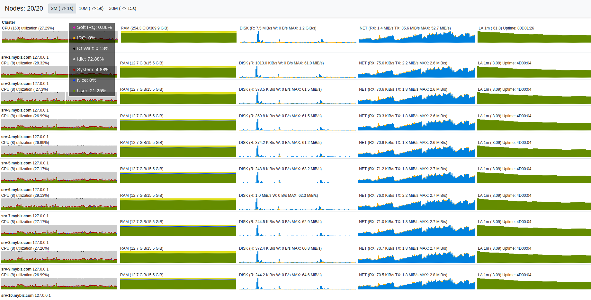
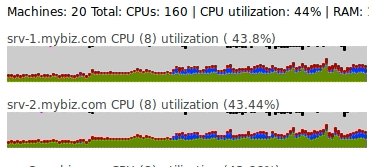
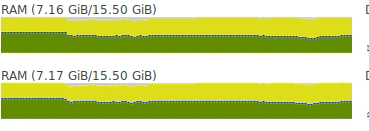
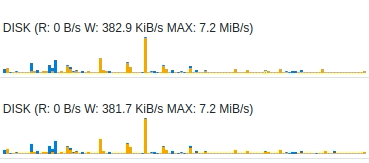
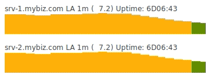

Hearth
------
Hearth is an SSH based real-time linux server monitoring solution.

It is particularly useful if you:
* are monitoring 2-15 servers
* don't want to (or can't) install monitoring software on each server
* don't care about historical data (>2 minutes)
* want to make the charts available to a number of people via a Web UI

Pre built releases are available for [windows and linux](https://github.com/aheart/hearth/releases).

### Features
Examine health and load patterns via a number of metrics across a small cluster.

For demo purposes all the charts are showing data for the same machine under different hostnames.

##### CPU

##### Memory

##### Disk

##### Network

##### Load Average

### Setup
1. [Download](https://github.com/aheart/hearth/releases) and extract Hearth
2. Rename **config.toml.dist** to **config.toml** and adjust it to your needs.
3. Run the hearth binary and navigate your browser to the ip/port configured in **config.toml**.

### Limitations
* Data can only be retrieved via SSH.
* Only ssh-agent authentication is supported.
* Network latency can skew the charts.
* Only a single network interface can be monitored per server.
* Only a single disk can be monitored per server.
* Current UI only works well on wide screens

# License

This project is licensed under either of

 * Apache License, Version 2.0, ([LICENSE-APACHE](LICENSE-APACHE) or
   http://www.apache.org/licenses/LICENSE-2.0)
 * MIT license ([LICENSE-MIT](LICENSE-MIT) or
   http://opensource.org/licenses/MIT)

at your option.

### Contribution

Unless you explicitly state otherwise, any contribution intentionally submitted for inclusion in the work by you, as defined in the Apache-2.0 license, shall be dual licensed as above, without any additional terms or conditions.
